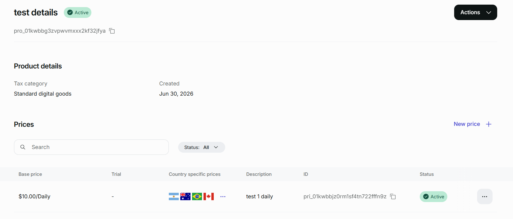

# paddle-localized-pricing-builder



A web app for setting country-specific Paddle prices from purchasing-power data.

Start with a base price, pick a strategy, and review recommended local amounts across 50+ markets. When you are ready, load an existing Paddle price and push the localized amounts into your catalog.

## Features

- PPP pricing matrix with strategy presets, profit estimates, and CSV/JSON export
- Nominal exchange rates from [currencyapi.com](https://currencyapi.com), cached on disk and applied only after you fetch them
- Preview of the base price and country overrides before anything is written
- Updates an existing Paddle price without changing billing cycle, tax mode, or other catalog fields
- Keeps overrides for countries that are not in the calculator
- Always shows whether you are connected to **sandbox** or **production**, with an extra confirmation before live updates

See [Paddle: Localize prices](https://developer.paddle.com/build/products/offer-localized-pricing/) for how country-specific pricing works in the catalog.

## Getting started

**Requirements:** Node.js 20+ and [pnpm](https://pnpm.io).

```bash
pnpm install
cp .env.example .env
```

Edit `.env`:

| Variable | Description |
| --- | --- |
| `PADDLE_API_KEY` | API key from Paddle → Developer tools → Authentication |
| `PADDLE_ENVIRONMENT` | `sandbox` or `production` (required; the server will not start without it) |
| `CURRENCYAPI_API_KEY` | API key from [currencyapi.com](https://currencyapi.com). Server-only. Used when you click **Fetch exchange rates** or **Re-fetch rates** |

```bash
pnpm dev
```

Open [http://localhost:3000](http://localhost:3000).

## Usage

1. If exchange rates have not been fetched yet, click **Fetch exchange rates**. Use **Re-fetch rates** when you want a newer snapshot.
2. Set the base amount and currency, then choose a pricing strategy.
3. Paste a Paddle price id (`pri_...`) and load the current catalog values.
4. Check the preview. Markets Paddle does not bill (for example IDR or AED) are listed as skipped.
5. Apply the update. On production, confirm the warning before the write goes through.
